# 13. V1 Data Layer Rebuild (POC -> V1)

## Purpose
This document defines the V1 data architecture to replace the POC-era free-form data model with a normalized, key-driven schema.

## Why Rebuild
POC tables allowed free-form values in business-critical fields (LOB, service type, owner role, contact type). This caused:
- inconsistent values and drift (`Security`, `SEC-OPS`, `SecOps`),
- weak referential integrity,
- complex UI workarounds,
- brittle analytics and reconciliation.

## V1 Design Principles
1. All business dimensions use lookup keys, not free-form text.
2. Enforce referential integrity with foreign keys.
3. Preserve immutable history through audit/event tables.
4. Separate reference data from transactional entities.
5. Support environment portability (`catalog`, `schema`, `env`) in all DDL.
6. Use additive, versioned migrations only.

## Canonical Entities
### Reference (Lookup)
- `lkp_line_of_business`
- `lkp_service_type`
- `lkp_owner_role`
- `lkp_contact_type`
- `lkp_lifecycle_state`
- `lkp_risk_tier`

### Core Domain
- `vendor`
- `vendor_identifier`
- `offering`
- `project`
- `vendor_owner_assignment`
- `offering_owner_assignment`
- `project_owner_assignment`
- `vendor_contact`
- `offering_contact`
- `vendor_lob_assignment`
- `offering_lob_assignment`
- `project_offering_map`

### Governance / Operations
- `change_request`
- `change_event`
- `schema_version`
- `vendor_merge_event`
- `vendor_merge_member`
- `vendor_merge_snapshot`
- `vendor_survivorship_decision`

## Full ERD

```mermaid
erDiagram
    lkp_line_of_business {
      string lob_id PK
      string lob_code UK
      string lob_name
      boolean active_flag
      int sort_order
      timestamp effective_from
      timestamp effective_to
    }

    lkp_service_type {
      string service_type_id PK
      string service_type_code UK
      string service_type_name
      boolean active_flag
      int sort_order
    }

    lkp_owner_role {
      string owner_role_id PK
      string owner_role_code UK
      string owner_role_name
      boolean active_flag
    }

    lkp_contact_type {
      string contact_type_id PK
      string contact_type_code UK
      string contact_type_name
      boolean active_flag
    }

    lkp_lifecycle_state {
      string lifecycle_state_id PK
      string lifecycle_state_code UK
      string lifecycle_state_name
      boolean active_flag
    }

    lkp_risk_tier {
      string risk_tier_id PK
      string risk_tier_code UK
      string risk_tier_name
      boolean active_flag
    }

    vendor {
      string vendor_id PK
      string legal_name
      string display_name
      string lifecycle_state_id FK
      string risk_tier_id FK
      string primary_lob_id FK
      timestamp created_at
      timestamp updated_at
      string updated_by
    }

    vendor_identifier {
      string vendor_identifier_id PK
      string vendor_id FK
      string source_system_code
      string source_vendor_key
      string identifier_type
      boolean is_primary_source
      string verification_status
      boolean active_flag
      timestamp first_seen_at
      timestamp last_seen_at
      timestamp created_at
      timestamp updated_at
    }

    offering {
      string offering_id PK
      string vendor_id FK
      string offering_name
      string lifecycle_state_id FK
      string primary_lob_id FK
      string primary_service_type_id FK
      timestamp created_at
      timestamp updated_at
      string updated_by
    }

    project {
      string project_id PK
      string project_name
      string lifecycle_state_id FK
      string primary_lob_id FK
      timestamp created_at
      timestamp updated_at
      string updated_by
    }

    vendor_lob_assignment {
      string assignment_id PK
      string vendor_id FK
      string lob_id FK
      boolean is_primary
      boolean active_flag
      timestamp created_at
      timestamp ended_at
    }

    offering_lob_assignment {
      string assignment_id PK
      string offering_id FK
      string lob_id FK
      boolean is_primary
      boolean active_flag
      timestamp created_at
      timestamp ended_at
    }

    vendor_owner_assignment {
      string assignment_id PK
      string vendor_id FK
      string owner_role_id FK
      string user_principal
      boolean active_flag
      timestamp created_at
      timestamp ended_at
    }

    offering_owner_assignment {
      string assignment_id PK
      string offering_id FK
      string owner_role_id FK
      string user_principal
      boolean active_flag
      timestamp created_at
      timestamp ended_at
    }

    project_owner_assignment {
      string assignment_id PK
      string project_id FK
      string owner_role_id FK
      string user_principal
      boolean active_flag
      timestamp created_at
      timestamp ended_at
    }

    vendor_contact {
      string vendor_contact_id PK
      string vendor_id FK
      string contact_type_id FK
      string full_name
      string email
      string phone
      boolean active_flag
    }

    offering_contact {
      string offering_contact_id PK
      string offering_id FK
      string contact_type_id FK
      string full_name
      string email
      string phone
      boolean active_flag
    }

    project_offering_map {
      string project_offering_map_id PK
      string project_id FK
      string offering_id FK
      boolean active_flag
      timestamp created_at
      timestamp ended_at
    }

    change_request {
      string request_id PK
      string entity_type
      string entity_id
      string change_type
      string payload_json
      string request_status
      timestamp created_at
      string created_by
    }

    change_event {
      string event_id PK
      string request_id FK
      string entity_type
      string entity_id
      string action
      string payload_json
      timestamp created_at
      string created_by
    }

    vendor_merge_event {
      string merge_id PK
      string survivor_vendor_id FK
      string merge_status
      string merge_reason
      string merge_method
      double confidence_score
      string request_id FK
      timestamp merged_at
      string merged_by
    }

    vendor_merge_member {
      string merge_member_id PK
      string merge_id FK
      string vendor_id FK
      string member_role
      string source_system_code
      string source_vendor_key
      string pre_merge_display_name
      boolean active_flag
      timestamp created_at
    }

    vendor_merge_snapshot {
      string snapshot_id PK
      string merge_id FK
      string vendor_id FK
      string snapshot_json
      timestamp captured_at
      string captured_by
    }

    vendor_survivorship_decision {
      string decision_id PK
      string merge_id FK
      string field_name
      string chosen_vendor_id FK
      string chosen_value_text
      string decision_method
      string decision_note
      timestamp decided_at
      string decided_by
    }

    schema_version {
      int version_num PK
      string description
      timestamp applied_at
      string applied_by
    }

    vendor ||--o{ offering : has
    vendor ||--o{ vendor_identifier : aliases
    vendor ||--o{ vendor_lob_assignment : assigned
    offering ||--o{ offering_lob_assignment : assigned
    vendor ||--o{ vendor_owner_assignment : has
    offering ||--o{ offering_owner_assignment : has
    project ||--o{ project_owner_assignment : has
    vendor ||--o{ vendor_contact : has
    offering ||--o{ offering_contact : has
    project ||--o{ project_offering_map : maps
    offering ||--o{ project_offering_map : maps

    lkp_line_of_business ||--o{ vendor_lob_assignment : used_by
    lkp_line_of_business ||--o{ offering_lob_assignment : used_by
    lkp_line_of_business ||--o{ vendor : primary
    lkp_line_of_business ||--o{ offering : primary
    lkp_line_of_business ||--o{ project : primary

    lkp_service_type ||--o{ offering : primary
    lkp_owner_role ||--o{ vendor_owner_assignment : role
    lkp_owner_role ||--o{ offering_owner_assignment : role
    lkp_owner_role ||--o{ project_owner_assignment : role
    lkp_contact_type ||--o{ vendor_contact : type
    lkp_contact_type ||--o{ offering_contact : type

    lkp_lifecycle_state ||--o{ vendor : lifecycle
    lkp_lifecycle_state ||--o{ offering : lifecycle
    lkp_lifecycle_state ||--o{ project : lifecycle
    lkp_risk_tier ||--o{ vendor : risk

    change_request ||--o{ change_event : emits
    change_request ||--o{ vendor_merge_event : authorizes
    vendor ||--o{ vendor_merge_event : survives
    vendor_merge_event ||--o{ vendor_merge_member : includes
    vendor_merge_event ||--o{ vendor_merge_snapshot : snapshots
    vendor_merge_event ||--o{ vendor_survivorship_decision : decides
    vendor ||--o{ vendor_merge_member : member
    vendor ||--o{ vendor_merge_snapshot : snapshotted
    vendor ||--o{ vendor_survivorship_decision : selected
```

  ## Merge-Safe Workflow (No Data Loss)
  1. Ingest unmatched vendor as a normal `vendor` row and retain every external key in `vendor_identifier`.
  2. When duplicate detection confirms overlap, create one `vendor_merge_event` with a chosen survivor vendor.
  3. Add all participating vendors to `vendor_merge_member` (`survivor` and `source`).
  4. Capture pre-merge full JSON snapshots per participant in `vendor_merge_snapshot`.
  5. Record field-level survivorship choices in `vendor_survivorship_decision`.
  6. Repoint dependent rows to survivor and keep lineage records immutable for future audits and joins.

## Lessons Learned Applied
- **POC anti-pattern:** storing labels in transaction tables.
  - **V1 fix:** store only lookup IDs; labels resolved at read-time.
- **POC anti-pattern:** UI-based validation only.
  - **V1 fix:** enforce constraints in DB and repository write methods.
- **POC anti-pattern:** inconsistent deactivation semantics.
  - **V1 fix:** standardized `active_flag`, `created_at`, `ended_at` on assignment tables.
- **POC anti-pattern:** migration uncertainty.
  - **V1 fix:** deterministic migration scripts + reconciliation report for unknown values.
- **POC anti-pattern:** no canonical cross-system identifier mapping.
  - **V1 fix:** `vendor_identifier` table with unique `(source_system_code, source_vendor_key)` for deterministic entity resolution.

## Migration Strategy (High Level)
1. Create V1 lookup and core tables in parallel schema.
2. Backfill lookup keys from legacy values using mapping rules.
3. Load core/assignment tables with FK references.
4. Run reconciliation for unmapped values (`UNMAPPED_*` rows).
5. Switch application reads/writes to V1 schema.
6. Freeze legacy writes; deprecate legacy columns after verification window.

## Definition of Done for V1 Data Layer
- 100% of LOB/service-type/role/contact references use FK IDs.
- No free-form writes accepted for governed dimensions.
- Migration and rollback scripts validated in dev + QA.
- Data quality checks green (uniqueness, FK integrity, null constraints).
- Reporting queries execute exclusively on V1 entities.
