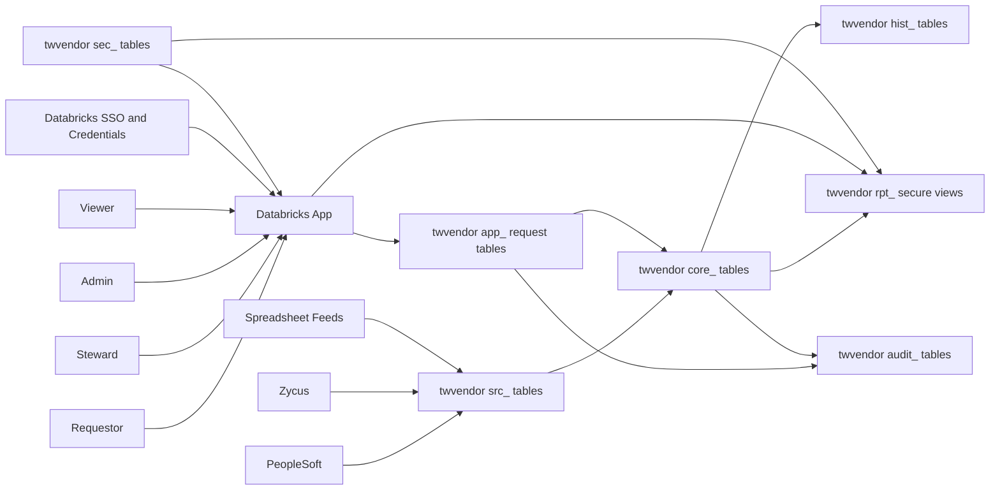

# System Context Diagram

```mermaid
flowchart LR
  U1[Requestor] --> APP[Databricks App]
  U2[Steward] --> APP
  U3[Admin] --> APP
  U4[Viewer] --> APP
  SSO[Databricks SSO and Credentials] --> APP
  PS[PeopleSoft] --> SRC[twvendor src_ tables]
  ZY[Zycus] --> SRC
  XL[Spreadsheet Feeds] --> SRC
  SRC --> CORE[twvendor core_ tables]
  CORE --> HIST[twvendor hist_ tables]
  CORE --> RPT[twvendor rpt_ secure views]
  APP --> RPT
  APP --> APPW[twvendor app_ request tables]
  APPW --> CORE
  APPW --> AUD[twvendor audit_ tables]
  CORE --> AUD
  SEC[twvendor sec_ tables] --> APP
  SEC --> RPT
```
