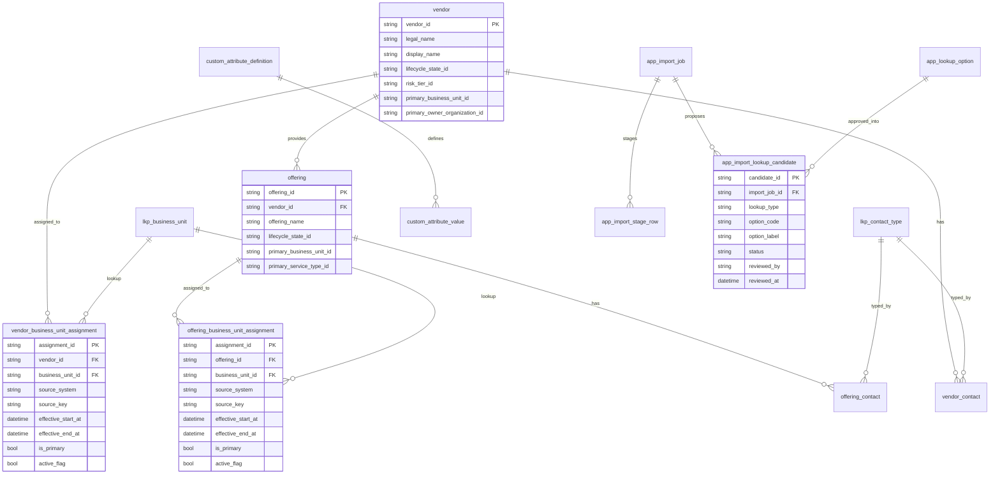

# Business Unit Canonical ERD

This ERD defines the canonical Business Unit model and the import governance path.

## Notes

- `vendor_business_unit_assignment` and `offering_business_unit_assignment` are the BU crosswalk tables and retain source traceability via `source_system` + `source_key`.
- Owner Organization remains a separate governed dimension from Business Unit.
- Import writes flow through staging and lookup-candidate approval before apply.
