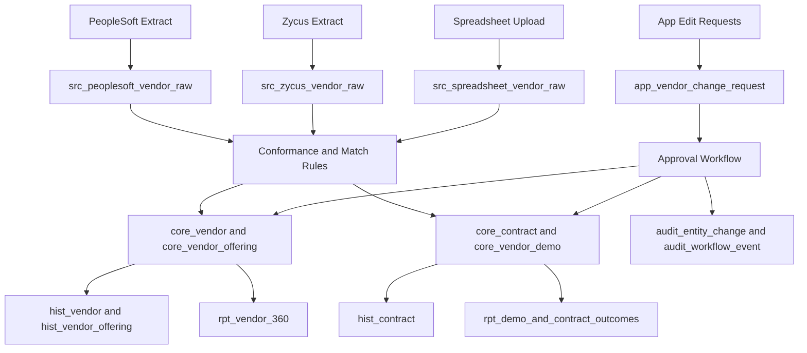

# Data Flow Diagram

```mermaid
flowchart TD
  A[PeopleSoft Extract] --> B[src_peoplesoft_vendor_raw]
  C[Zycus Extract] --> D[src_zycus_vendor_raw]
  E[Spreadsheet Upload] --> F[src_spreadsheet_vendor_raw]
  B --> G[Conformance and Match Rules]
  D --> G
  F --> G
  G --> H[core_vendor and core_vendor_offering]
  G --> I[core_contract and core_vendor_demo]
  H --> J[hist_vendor and hist_vendor_offering]
  I --> K[hist_contract]
  H --> L[rpt_vendor_360]
  I --> M[rpt_demo_and_contract_outcomes]
  N[App Edit Requests] --> O[app_vendor_change_request]
  O --> P[Approval Workflow]
  P --> H
  P --> I
  P --> Q[audit_entity_change and audit_workflow_event]
```
